<div align="center">

# 👁️ DRISHTI
### Disaster Responsive Intelligent Simulator & Tracking Interface


**An automated AI annotation and tracking interface for disaster response scenarios.**

[🚀 Getting Started](#-getting-started) | [🛠️ How It Works](#-how-it-works) | [📄 Documentation](docs/)

</div>

---

## 📖 Overview

**DRISHTI** (Vision) is a specialized tool designed to accelerate the creation of disaster datasets. It uses state-of-the-art **YOLOv11** models to automatically detect and annotate objects in disaster footage (floods, rubble, survivors), drastically reducing the time required for manual labeling.

This tool provides a user-friendly GUI that allows first responders or researchers to batch-process folders of images, generating both visual overlays and standard YOLO-format text labels for training downstream models.

## ✨ Key Features

| Feature | Description | Tech Stack |
| :--- | :--- | :--- |
| **🤖 Auto-Annotation** | Automatically detects objects and generates bounding boxes. | Ultralytics YOLOv11 |
| **🏷️ Label Generation** | Exports standard YOLO `.txt` labels for retraining. | Python File I/O |
| **🖼️ Visual Feedback** | Saves annotated images for verification. | PIL / OpenCV |
| **🖱️ GUI Interface** | Simple "Point & Click" folder selection. | Tkinter |
| **⚡ Batch Processing** | Handles distinct datasets with thousands of images. | Python Multiprocessing |

## 🏗️ Workflow

```mermaid
graph LR
    User[👤 User] -->|Select Folder| GUI[🖥️ DRISHTI GUI]
    GUI -->|Load Images| Engine[⚙️ Inference Engine]
    Engine -->|YOLOv11| Model[🧠 Detection Model]
    Model -->|Detections| Output
    
    subgraph Output Generation
        Output -->|Draw Boxes| IMG[🖼️ Annotated Images]
        Output -->|Write coords| TXT[📝 YOLO .txt Labels]
    end
```



## 🚀 Getting Started

### Prerequisites
- Python 3.9+
- CUDA-enabled GPU (optional, for faster inference)

### 1. Clone the Repository
```bash
git clone https://github.com/KanavjeetS/DRISHTI.git
cd DRISHTI
```

### 2. Install Dependencies
```bash
pip install -r requirements.txt
```

### 3. Run the Annotator
```bash
python src/drishti_annotator.py
```
A window will pop up. Select the folder containing your raw disaster images. The tool will automatically create:
- `annotated_valid/`: Images with bounding boxes drawn.
- `annotations_valid/`: Text files with class coordinates.

## 📂 Project Structure

```bash
DRISHTI/
├── 🧠 src/
│   └── drishti_annotator.py  # Main GUI & Inference Logic
├── 💾 data/
│   └── samples/              # Sample Disaster Images
├── 📄 docs/                  # Presentations & Archives
└── 📝 requirements.txt       # Dependencies
```

## 🤝 Contributing

Contributions are welcome! Please feel free to submit a Pull Request to support more model architectures (e.g., RT-DETR, Faster-RCNN).

## 📜 License

This project is licensed under the MIT License.

## ✍️ Citation

If you use DRISHTI in your research, please cite:

```bibtex
@software{drishti2026,
  author = {Singh, Kanavjeet},
  title = {DRISHTI: Disaster Responsive Intelligent Simulator Tracking Interface},
  year = {2026},
  url = {https://github.com/KanavjeetS/DRISHTI}
}
```

---
<div align="center">
  <sub>Built with ❤️ for Safer Communities by <a href="https://github.com/KanavjeetS">Kanavjeet Singh</a></sub>
</div>
